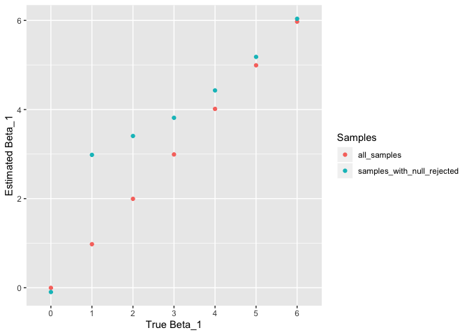

p8105\_hw5\_bsr2136
================
Barik Rajpal
11/9/2019

## Problem 0

``` r
dir.create("files_for_hw5")
```

## Problem 1

``` r
set.seed(10)

iris_with_missing = iris %>% 
  map_df(~replace(.x, sample(1:150, 20), NA)) %>%
  mutate(Species = as.character(Species))
```

### Function to remove missing values

``` r
remove_missing <- function(x) {
  
  if (is.numeric(x)) {
      for (i in 1:length(x)) {
          if (is.na(x[i])) {
              x[i] = mean(x,na.rm=T)
          }
      }
  }
  else if (is.character(x)) {
          for (i in 1:length(x)) {
              if (is.na(x[i])) {
                  x[i] = "virginica"
              }
          }
  }
  else stop("Not numeric or character")
  x
}
```

### Applying the function to iris\_with\_missing df

``` r
map(iris_with_missing,remove_missing)
```

    ## $Sepal.Length
    ##   [1] 5.100000 4.900000 4.700000 4.600000 5.000000 5.400000 5.819231
    ##   [8] 5.000000 4.400000 4.900000 5.400000 4.800000 5.819231 4.300000
    ##  [15] 5.819231 5.700000 5.400000 5.100000 5.700000 5.100000 5.400000
    ##  [22] 5.100000 4.600000 5.819231 4.800000 5.000000 5.000000 5.200000
    ##  [29] 5.819231 4.700000 4.800000 5.400000 5.200000 5.500000 4.900000
    ##  [36] 5.000000 5.500000 4.900000 4.400000 5.100000 5.000000 4.500000
    ##  [43] 4.400000 5.000000 5.100000 4.800000 5.100000 4.600000 5.300000
    ##  [50] 5.000000 7.000000 6.400000 6.900000 5.500000 6.500000 5.700000
    ##  [57] 6.300000 4.900000 6.600000 5.200000 5.000000 5.900000 6.000000
    ##  [64] 6.100000 5.600000 6.700000 5.600000 5.800000 6.200000 5.600000
    ##  [71] 5.900000 5.819231 6.300000 5.819231 6.400000 6.600000 6.800000
    ##  [78] 6.700000 6.000000 5.700000 5.500000 5.819231 5.800000 6.000000
    ##  [85] 5.400000 5.819231 6.700000 5.819231 5.600000 5.500000 5.500000
    ##  [92] 5.819231 5.800000 5.000000 5.819231 5.700000 5.700000 6.200000
    ##  [99] 5.100000 5.700000 6.300000 5.800000 7.100000 6.300000 6.500000
    ## [106] 7.600000 4.900000 7.300000 6.700000 5.819231 6.500000 5.819231
    ## [113] 6.800000 5.700000 5.800000 6.400000 6.500000 7.700000 7.700000
    ## [120] 6.000000 5.819231 5.600000 7.700000 6.300000 6.700000 7.200000
    ## [127] 6.200000 6.100000 6.400000 7.200000 7.400000 7.900000 6.400000
    ## [134] 5.819231 6.100000 5.819231 5.819231 6.400000 6.000000 6.900000
    ## [141] 6.700000 6.900000 5.819231 6.800000 6.700000 6.700000 6.300000
    ## [148] 6.500000 5.819231 5.900000
    ## 
    ## $Sepal.Width
    ##   [1] 3.500000 3.000000 3.200000 3.100000 3.600000 3.900000 3.400000
    ##   [8] 3.400000 2.900000 3.100000 3.075385 3.400000 3.075385 3.000000
    ##  [15] 4.000000 4.400000 3.900000 3.500000 3.800000 3.800000 3.400000
    ##  [22] 3.700000 3.600000 3.300000 3.400000 3.000000 3.400000 3.500000
    ##  [29] 3.400000 3.200000 3.100000 3.075385 3.075385 4.200000 3.100000
    ##  [36] 3.200000 3.500000 3.600000 3.000000 3.400000 3.500000 3.075385
    ##  [43] 3.200000 3.500000 3.800000 3.000000 3.800000 3.200000 3.700000
    ##  [50] 3.075385 3.075385 3.200000 3.100000 2.300000 2.800000 2.800000
    ##  [57] 3.300000 2.400000 2.900000 2.700000 2.000000 3.000000 2.200000
    ##  [64] 2.900000 2.900000 3.100000 3.000000 3.075385 2.200000 2.500000
    ##  [71] 3.200000 2.800000 2.500000 2.800000 2.900000 3.000000 2.800000
    ##  [78] 3.075385 3.075385 2.600000 2.400000 2.400000 2.700000 2.700000
    ##  [85] 3.000000 3.400000 3.100000 3.075385 3.000000 2.500000 3.075385
    ##  [92] 3.075385 3.075385 2.300000 2.700000 3.000000 2.900000 2.900000
    ##  [99] 2.500000 2.800000 3.075385 2.700000 3.000000 2.900000 3.075385
    ## [106] 3.000000 2.500000 2.900000 3.075385 3.600000 3.200000 2.700000
    ## [113] 3.000000 3.075385 2.800000 3.200000 3.000000 3.800000 2.600000
    ## [120] 2.200000 3.200000 3.075385 2.800000 2.700000 3.300000 3.200000
    ## [127] 2.800000 3.000000 2.800000 3.000000 2.800000 3.800000 2.800000
    ## [134] 2.800000 3.075385 3.000000 3.400000 3.100000 3.000000 3.100000
    ## [141] 3.100000 3.100000 2.700000 3.200000 3.300000 3.000000 2.500000
    ## [148] 3.000000 3.400000 3.000000
    ## 
    ## $Petal.Length
    ##   [1] 1.400000 1.400000 1.300000 1.500000 1.400000 1.700000 1.400000
    ##   [8] 1.500000 1.400000 3.765385 1.500000 1.600000 1.400000 3.765385
    ##  [15] 3.765385 1.500000 1.300000 1.400000 1.700000 1.500000 1.700000
    ##  [22] 1.500000 1.000000 3.765385 1.900000 3.765385 1.600000 1.500000
    ##  [29] 1.400000 1.600000 3.765385 1.500000 1.500000 1.400000 3.765385
    ##  [36] 1.200000 1.300000 1.400000 1.300000 1.500000 1.300000 1.300000
    ##  [43] 1.300000 1.600000 1.900000 1.400000 1.600000 3.765385 1.500000
    ##  [50] 1.400000 4.700000 4.500000 4.900000 4.000000 4.600000 4.500000
    ##  [57] 4.700000 3.765385 4.600000 3.900000 3.765385 4.200000 4.000000
    ##  [64] 4.700000 3.600000 4.400000 4.500000 4.100000 4.500000 3.900000
    ##  [71] 4.800000 4.000000 4.900000 3.765385 4.300000 4.400000 4.800000
    ##  [78] 5.000000 4.500000 3.500000 3.800000 3.700000 3.900000 5.100000
    ##  [85] 4.500000 4.500000 4.700000 4.400000 3.765385 4.000000 4.400000
    ##  [92] 4.600000 4.000000 3.300000 4.200000 4.200000 4.200000 4.300000
    ##  [99] 3.000000 4.100000 3.765385 5.100000 5.900000 5.600000 5.800000
    ## [106] 6.600000 4.500000 6.300000 3.765385 3.765385 5.100000 5.300000
    ## [113] 5.500000 5.000000 5.100000 5.300000 3.765385 6.700000 6.900000
    ## [120] 5.000000 5.700000 4.900000 6.700000 4.900000 5.700000 6.000000
    ## [127] 4.800000 4.900000 5.600000 5.800000 6.100000 3.765385 3.765385
    ## [134] 5.100000 5.600000 6.100000 5.600000 5.500000 4.800000 5.400000
    ## [141] 5.600000 5.100000 5.100000 3.765385 3.765385 5.200000 5.000000
    ## [148] 5.200000 5.400000 5.100000
    ## 
    ## $Petal.Width
    ##   [1] 0.200000 0.200000 0.200000 1.192308 0.200000 0.400000 0.300000
    ##   [8] 0.200000 0.200000 0.100000 0.200000 0.200000 0.100000 0.100000
    ##  [15] 0.200000 0.400000 0.400000 1.192308 0.300000 1.192308 0.200000
    ##  [22] 0.400000 0.200000 0.500000 0.200000 0.200000 0.400000 0.200000
    ##  [29] 0.200000 0.200000 0.200000 0.400000 0.100000 0.200000 0.200000
    ##  [36] 0.200000 0.200000 0.100000 1.192308 0.200000 0.300000 1.192308
    ##  [43] 0.200000 0.600000 0.400000 0.300000 0.200000 0.200000 0.200000
    ##  [50] 0.200000 1.400000 1.500000 1.500000 1.300000 1.500000 1.300000
    ##  [57] 1.600000 1.000000 1.300000 1.400000 1.000000 1.500000 1.192308
    ##  [64] 1.400000 1.300000 1.400000 1.500000 1.000000 1.500000 1.100000
    ##  [71] 1.800000 1.300000 1.500000 1.200000 1.300000 1.400000 1.400000
    ##  [78] 1.192308 1.192308 1.000000 1.100000 1.000000 1.200000 1.600000
    ##  [85] 1.500000 1.600000 1.192308 1.300000 1.192308 1.192308 1.200000
    ##  [92] 1.192308 1.192308 1.192308 1.300000 1.200000 1.300000 1.300000
    ##  [99] 1.192308 1.300000 2.500000 1.900000 2.100000 1.800000 2.200000
    ## [106] 2.100000 1.700000 1.800000 1.800000 2.500000 2.000000 1.900000
    ## [113] 2.100000 2.000000 2.400000 2.300000 1.800000 1.192308 2.300000
    ## [120] 1.500000 1.192308 2.000000 2.000000 1.800000 2.100000 1.800000
    ## [127] 1.800000 1.800000 2.100000 1.600000 1.192308 2.000000 2.200000
    ## [134] 1.500000 1.400000 2.300000 1.192308 1.192308 1.800000 2.100000
    ## [141] 2.400000 2.300000 1.900000 2.300000 2.500000 2.300000 1.900000
    ## [148] 2.000000 2.300000 1.800000
    ## 
    ## $Species
    ##   [1] "setosa"     "setosa"     "setosa"     "setosa"     "setosa"    
    ##   [6] "setosa"     "setosa"     "setosa"     "setosa"     "setosa"    
    ##  [11] "setosa"     "setosa"     "setosa"     "setosa"     "setosa"    
    ##  [16] "setosa"     "setosa"     "setosa"     "setosa"     "setosa"    
    ##  [21] "setosa"     "virginica"  "setosa"     "setosa"     "virginica" 
    ##  [26] "setosa"     "virginica"  "setosa"     "setosa"     "setosa"    
    ##  [31] "setosa"     "setosa"     "setosa"     "setosa"     "setosa"    
    ##  [36] "setosa"     "setosa"     "setosa"     "setosa"     "setosa"    
    ##  [41] "setosa"     "virginica"  "setosa"     "setosa"     "setosa"    
    ##  [46] "virginica"  "setosa"     "setosa"     "setosa"     "setosa"    
    ##  [51] "virginica"  "versicolor" "versicolor" "versicolor" "versicolor"
    ##  [56] "versicolor" "virginica"  "versicolor" "virginica"  "versicolor"
    ##  [61] "versicolor" "versicolor" "versicolor" "versicolor" "versicolor"
    ##  [66] "versicolor" "versicolor" "versicolor" "versicolor" "versicolor"
    ##  [71] "versicolor" "virginica"  "versicolor" "versicolor" "versicolor"
    ##  [76] "versicolor" "versicolor" "versicolor" "versicolor" "virginica" 
    ##  [81] "versicolor" "versicolor" "versicolor" "versicolor" "versicolor"
    ##  [86] "versicolor" "versicolor" "versicolor" "versicolor" "versicolor"
    ##  [91] "versicolor" "versicolor" "versicolor" "virginica"  "versicolor"
    ##  [96] "versicolor" "versicolor" "versicolor" "versicolor" "virginica" 
    ## [101] "virginica"  "virginica"  "virginica"  "virginica"  "virginica" 
    ## [106] "virginica"  "virginica"  "virginica"  "virginica"  "virginica" 
    ## [111] "virginica"  "virginica"  "virginica"  "virginica"  "virginica" 
    ## [116] "virginica"  "virginica"  "virginica"  "virginica"  "virginica" 
    ## [121] "virginica"  "virginica"  "virginica"  "virginica"  "virginica" 
    ## [126] "virginica"  "virginica"  "virginica"  "virginica"  "virginica" 
    ## [131] "virginica"  "virginica"  "virginica"  "virginica"  "virginica" 
    ## [136] "virginica"  "virginica"  "virginica"  "virginica"  "virginica" 
    ## [141] "virginica"  "virginica"  "virginica"  "virginica"  "virginica" 
    ## [146] "virginica"  "virginica"  "virginica"  "virginica"  "virginica"

## Problem 2

``` r
names_df <- tibble(
                short_file = list.files("./files_for_hw5"),
                filenames = list.files("./files_for_hw5") %>%
                str_c("./files_for_hw5/",.)
            )

names_df <- names_df %>%
  mutate(list = map(pull(names_df,filenames), read_csv)) %>%
  unnest(list) %>%
  mutate(arm = ifelse(str_detect(short_file,"con"),"Control","Experimental"),
         subject_id = as.numeric(str_match(short_file,"[0-9]+"))
         ) %>%
  select(arm,subject_id,everything(),-short_file,-filenames) %>%
  pivot_longer(cols = week_1:week_8,
              names_to = "week",
              values_to = "observations") %>%
  mutate(week = as.numeric(str_match(week,"[0-9]+"))
           )

names_df %>%
  ggplot(aes(x=week,y=observations,color=as.factor(subject_id))) + 
  geom_line() +
  facet_grid(.~arm) + labs(color = "subject_id")
```

<!-- -->

The experimental subject observation values increase fairly
significantly over time. The control subject observation values
fluctuate over time, but don’t noticeably increase or decrease over
time.

## Problem 3

### sim\_regression function

``` r
sim_regression = function(n = 30, beta0 = 2, beta1 = 0, sigma_2 = 50) {
  
  sim_data = tibble(
    x = rnorm(n, mean = 0, sd = 1),
    y = beta0 + beta1 * x + rnorm(n, 0, sqrt(sigma_2))
  )
  
  ls_fit = lm(y ~ x, data = sim_data)
  
  tidy_ls_fit <- broom::tidy(ls_fit)
  
  tibble(
    beta1_hat = pull(tidy_ls_fit,estimate)[2],
    p_val = pull(tidy_ls_fit,p.value)[2]
  )
}
```

### running sim\_regression 10,000 times for beta\_1 = {0,1,2,3,4,5,6}, and then combining the tables

``` r
sim_results_0 <- rerun(10000, sim_regression(beta1 = 0)) %>% 
  bind_rows() %>%
  mutate(beta1_true = 0)

sim_results_1 <- rerun(10000, sim_regression(beta1 = 1)) %>% 
  bind_rows() %>%
  mutate(beta1_true = 1)

sim_results_2 <- rerun(10000, sim_regression(beta1 = 2)) %>% 
  bind_rows() %>%
  mutate(beta1_true = 2)

sim_results_3 <- rerun(10000, sim_regression(beta1 = 3)) %>% 
  bind_rows() %>%
  mutate(beta1_true = 3)

sim_results_4 <- rerun(10000, sim_regression(beta1 = 4)) %>% 
  bind_rows() %>%
  mutate(beta1_true = 4)

sim_results_5 <- rerun(10000, sim_regression(beta1 = 5)) %>% 
  bind_rows() %>%
  mutate(beta1_true = 5)

sim_results_6 <- rerun(10000, sim_regression(beta1 = 6)) %>% 
  bind_rows() %>%
  mutate(beta1_true = 6)

sim_results_total <- bind_rows(sim_results_0,sim_results_1,sim_results_2,sim_results_3,
                               sim_results_4,sim_results_5,sim_results_6)
```

### Plotting proportion of times the null was rejected

``` r
sim_results_total %>%
  group_by(beta1_true) %>%
  summarise(num_reject = sum(p_val <= .05),
            n = n(),
            proportion_rejected = num_reject/n) %>%
  ggplot(aes(x=as.factor(beta1_true),y=proportion_rejected)) +
  geom_col() +
  xlab("True Beta_1") +
  ylab("Proportion of Rejected Nulls")
```

<!-- -->

As the effect size increases, the power of the test also increases.

### Plotting estimates of beta1\_hat

``` r
sim_results_total %>%
  mutate(beta1_hat_rejected = ifelse(p_val <= .05,beta1_hat,NA)) %>%
  group_by(beta1_true) %>%
  summarise(avg_estimate = mean(beta1_hat),
            avg_estimate_when_rejected = mean(beta1_hat_rejected,na.rm=T)) %>%
  pivot_longer(avg_estimate:avg_estimate_when_rejected,
               names_to = "null_rejected",
               values_to = "estimate") %>%
  ggplot(aes(x=as.factor(beta1_true),y=estimate,color = null_rejected)) + 
  geom_point()
```

<!-- -->
